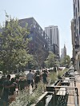

# Google API

## Geocode

```
LOCATION="? This Weekend: Stockholm Sweden - Aug 8 at Copperfields http://t.co/6un7xC9Sve"
curl -G "https://maps.googleapis.com/maps/api/geocode/json?key=$GEOCODE_API_KEY" --data-urlencode "address=$LOCATION"
```
```
{
   "results" : [
      {
         "address_components" : [
            {
               "long_name" : "Stockholm",
               "short_name" : "Stockholm",
               "types" : [ "locality", "political" ]
            },
            {
               "long_name" : "Stockholm County",
               "short_name" : "Stockholm County",
               "types" : [ "administrative_area_level_1", "political" ]
            },
            {
               "long_name" : "Sweden",
               "short_name" : "SE",
               "types" : [ "country", "political" ]
            }
         ],
         "formatted_address" : "Stockholm, Sweden",
         "geometry" : {
            "bounds" : {
               "northeast" : {
                  "lat" : 59.42784089999999,
                  "lng" : 18.198229
               },
               "southwest" : {
                  "lat" : 59.224443,
                  "lng" : 17.765876
               }
            },
            "location" : {
               "lat" : 59.32932349999999,
               "lng" : 18.0685808
            },
            "location_type" : "APPROXIMATE",
            "viewport" : {
               "northeast" : {
                  "lat" : 59.42784089999999,
                  "lng" : 18.198229
               },
               "southwest" : {
                  "lat" : 59.224443,
                  "lng" : 17.765876
               }
            }
         },
         "partial_match" : true,
         "place_id" : "ChIJywtkGTF2X0YRZnedZ9MnDag",
         "types" : [ "locality", "political" ]
      }
   ],
   "status" : "OK"
}
```

## Elevation

DOCS: https://developers.google.com/maps/documentation/elevation/overview

```
COORDS=39.7391536,-104.9847034
curl -G "https://maps.googleapis.com/maps/api/elevation/json?key="$GEOCODE_API_KEY --data-urlencode "locations=$COORDS"
```
```
{
     "results" : [
     {
         "elevation" : 1608.637939453125,
         "location" : {
             "lat" : 39.7391536,
             "lng" : -104.9847034
         },
         "resolution" : 4.771975994110107
     }
 ],
     "status" : "OK"
}
```


## Place Search - Nearby Search

```
COORDS=39.7391536,-104.9847034
curl -L -X GET "https://maps.googleapis.com/maps/api/place/nearbysearch/json?radius=100&key=$GEOCODE_API_KEY&location=$COORDS"
```
```
{
   "html_attributions" : [],
   "next_page_token" : "Aap_uED_ctl0r3nbQ2oaDECGFNgoCP_by76gazL3RqGlVhenc-5OnJc0TYItfRoNm1i0TxUBroFtJvaT9xZm2C3XEIFQXqSQQNfE2Hsg-g0L87SEYGX1s68AbAurN9LUiLHKgA_wagXVoBAZ9fwHxhUZMjR-qD9iljHzXaQYekDybf9Dd8uRjEyDqm0H81v-GbtEnLs5Y69TZutVSD3W1NrsOB5pYY11YGDuWE1WY4KA-PP1Laj4AI6q26ea7HMNo-xZ2Rp6BthD7_RUzKUKt2Xw3IXD14UxtK-KVNJ8HHDGMczqduZU3XUEYdZCNYnpQJL6IuG__lcqNNIDWxe_xmWQ6D4-s-v04_snPhA3bGOZ8J6x4d1GaDwBRtyTgj9RZgOp3eRUBffJ0-2TLozMX3n6KQYX0nI3h0hnJVMEDq47jvVj",
   "results" : [
      {
         "geometry" : {
            "location" : {
               "lat" : 39.7392358,
               "lng" : -104.990251
            },
            "viewport" : {
               "northeast" : {
                  "lat" : 39.91424694425041,
                  "lng" : -104.6002959250625
               },
               "southwest" : {
                  "lat" : 39.61443097092009,
                  "lng" : -105.1099269730715
               }
            }
         },
         "icon" : "https://maps.gstatic.com/mapfiles/place_api/icons/v1/png_71/geocode-71.png",
         "icon_background_color" : "#7B9EB0",
         "icon_mask_base_uri" : "https://maps.gstatic.com/mapfiles/place_api/icons/v2/generic_pinlet",
         "name" : "Denver",
         "photos" : [
            {
               "height" : 5632,
               "html_attributions" : [
                  "\u003ca href=\"https://maps.google.com/maps/contrib/100462446046062028593\"\u003eJosue Peraza\u003c/a\u003e"
               ],
               "photo_reference" : "Aap_uED1WkFiMb7m0AmDI0hwzzvrPvtAbBjK3UzSWP6c2ZuxFx-kI6p7PKf8Rdos7v7qtXgxCjd8Sv72UcABZ7R_gvDY5vB_T_5BNn39FZdfCC9OqyvoF1pyIY7B2bv0A8Jf-h-xjNgVAeItOz-kAnIiC988St3obmC9cWYHRCF61eEI4QLf",
               "width" : 4224
            }
         ],
         "place_id" : "ChIJzxcfI6qAa4cR1jaKJ_j0jhE",
         "reference" : "ChIJzxcfI6qAa4cR1jaKJ_j0jhE",
         "scope" : "GOOGLE",
         "types" : [ "locality", "political" ],
         "vicinity" : "Denver"
      },
      {
         "business_status" : "OPERATIONAL",
         "geometry" : {
            "location" : {
               "lat" : 39.73932509999999,
               "lng" : -104.9848069
            },
            "viewport" : {
               "northeast" : {
                  "lat" : 39.74056588029149,
                  "lng" : -104.9834348697085
               },
               "southwest" : {
                  "lat" : 39.73786791970849,
                  "lng" : -104.9861328302915
               }
            }
         },
         "icon" : "https://maps.gstatic.com/mapfiles/place_api/icons/v1/png_71/civic_building-71.png",
         "icon_background_color" : "#7B9EB0",
         "icon_mask_base_uri" : "https://maps.gstatic.com/mapfiles/place_api/icons/v2/civic-bldg_pinlet",
         "name" : "Colorado State Capitol",
         "opening_hours" : {
            "open_now" : false
         },
         "photos" : [
            {
               "height" : 3264,
               "html_attributions" : [
                  "\u003ca href=\"https://maps.google.com/maps/contrib/115900452866507994266\"\u003eAaron Gallegos Guzman\u003c/a\u003e"
               ],
               "photo_reference" : "Aap_uEDnG4U9gMv-hUGpvFeNpd0Pdh9QmCR-QhDgZrfgvE5rM_dhLMKLSDx6gjyHKePNlJbXzxET_UJPDEQwp8ngLBxM25ee-8suiSQXtesf2xesSUySzPQlFM1lYhTh0uC7N107QY7M_cylZITE5rcncfHzcriNFbL1Yl8pWovDLDYAWnNQ",
               "width" : 2448
            }
         ],
         "place_id" : "ChIJGclBlCp5bIcRjwqRDQIXohI",
         "plus_code" : {
            "compound_code" : "P2Q8+P3 Denver, CO, USA",
            "global_code" : "85FQP2Q8+P3"
         },
         "rating" : 4.5,
         "reference" : "ChIJGclBlCp5bIcRjwqRDQIXohI",
         "scope" : "GOOGLE",
         "types" : [
            "tourist_attraction",
            "local_government_office",
            "point_of_interest",
            "establishment"
         ],
         "user_ratings_total" : 501,
         "vicinity" : "200 East Colfax Avenue, Denver"
                  "lat" : 39.7383143197085,
                  "lng" : -104.9862525302915
      }
   ],
   "status" : "OK"
}
````


## Place Photos

DOCS: https://developers.google.com/maps/documentation/places/web-service/search-find-place

All requests to the Place Photo service must include a photoreference,
returned in the response to a Find Place, Nearby Search, Text Search, or Place Details request.
The response to these requests will contain a photos[] field if the place has related photographic content.


```
PHOTO_ID=Aap_uED1WkFiMb7m0AmDI0hwzzvrPvtAbBjK3UzSWP6c2ZuxFx-kI6p7PKf8Rdos7v7qtXgxCjd8Sv72UcABZ7R_gvDY5vB_T_5BNn39FZdfCC9OqyvoF1pyIY7B2bv0A8Jf-h-xjNgVAeItOz-kAnIiC988St3obmC9cWYHRCF61eEI4QLf

curl -L -X GET "https://maps.googleapis.com/maps/api/place/photo?maxwidth=100&photo_reference=$PHOTO_ID&key=$GEOCODE_API_KEY" --output "./cache/photos/$PHOTO_ID.jpg"
```


